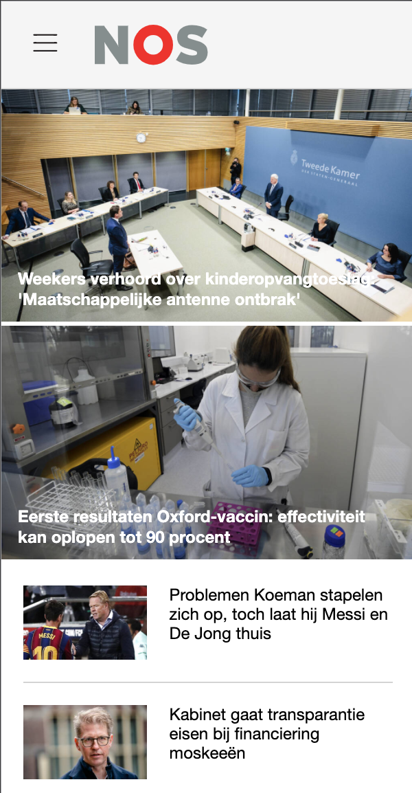
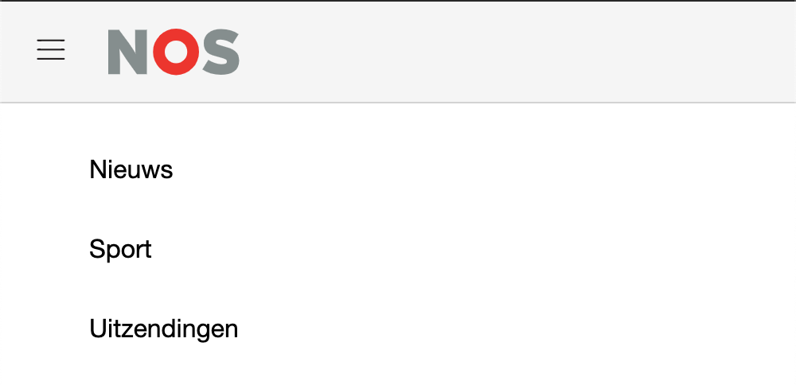
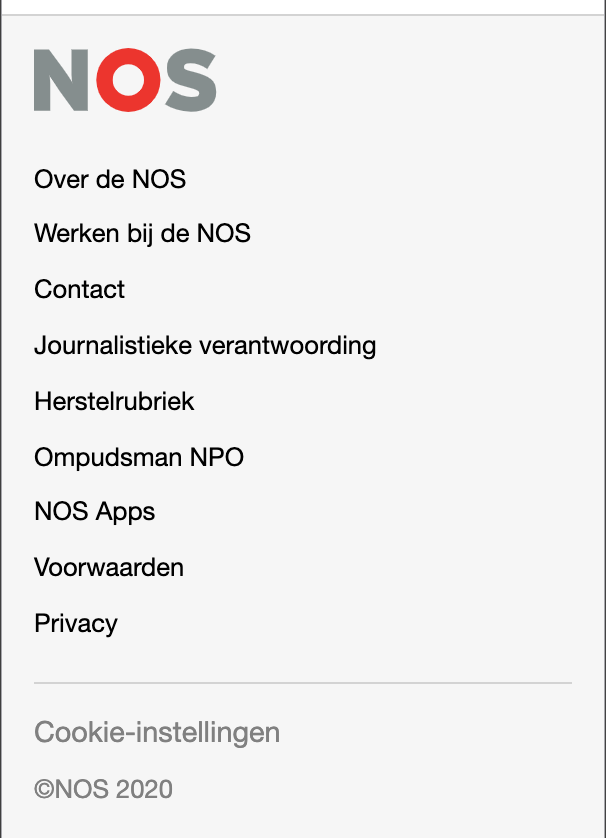
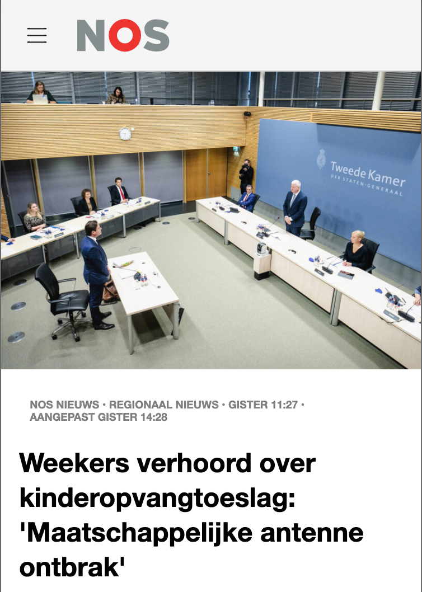
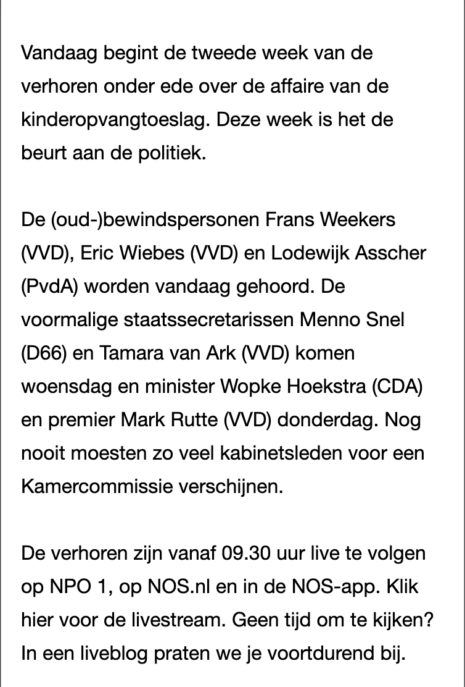
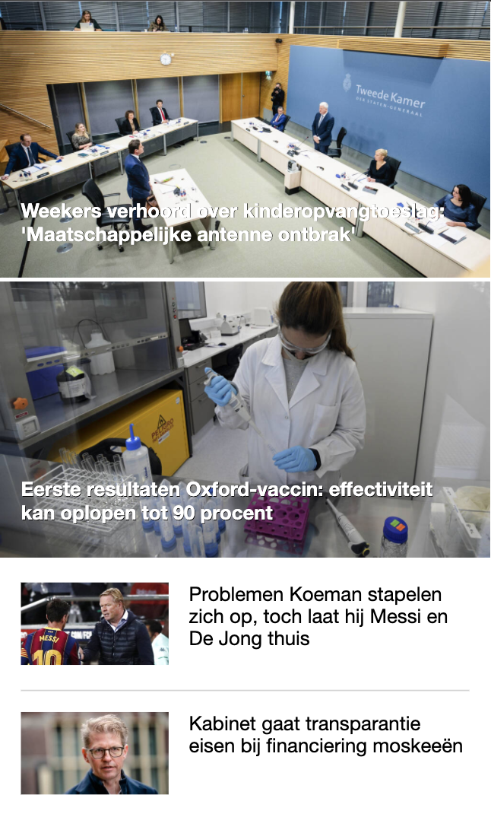
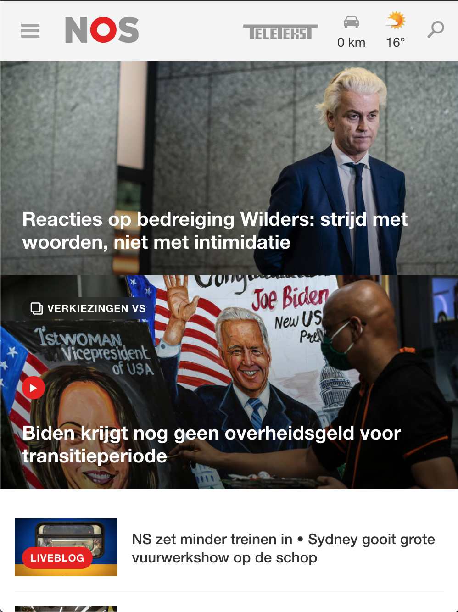
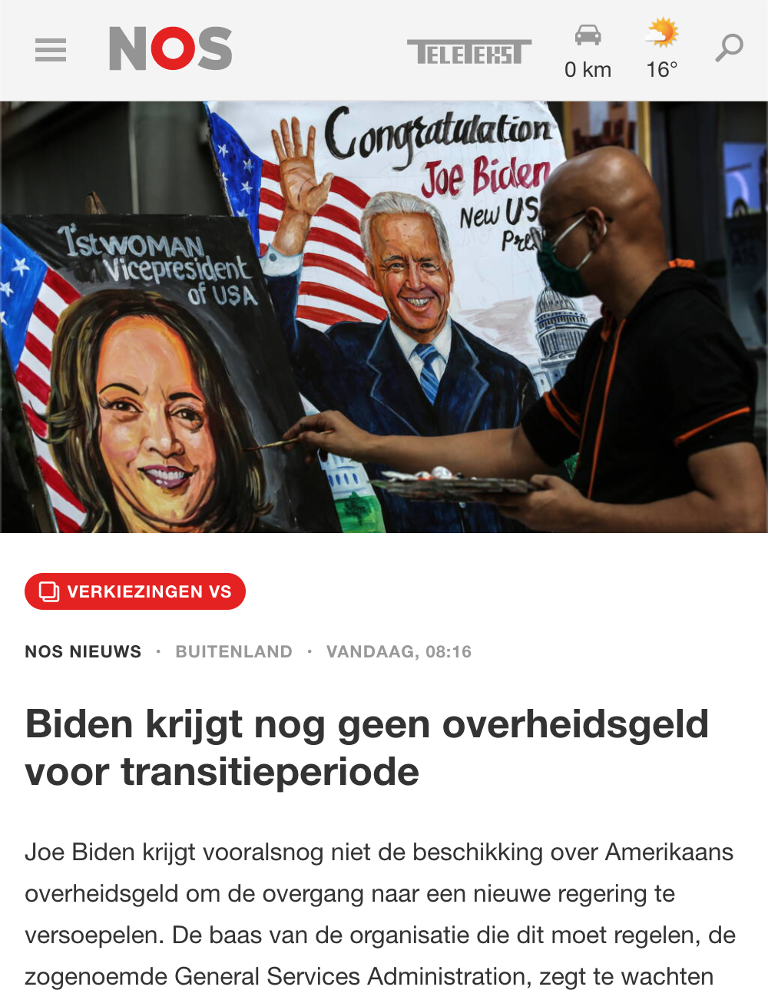

# Procesverslag
**Auteur:** -Joël Zwaan-

Markdown cheat cheet: [Hulp bij het schrijven van Markdown](https://github.com/adam-p/markdown-here/wiki/Markdown-Cheatsheet). Nb. de standaardstructuur en de spartaanse opmaak zijn helemaal prima. Het gaat om de inhoud van je procesverslag. Besteedt de tijd voor pracht en praal aan je website.

## Bronnenlijst
1. https://www.w3schools.com/
2. https://stackoverflow.com/
3. https://youtube.com/
4. https://css-tricks.com/
5. Danny de Vries :)

## Eindgesprek (week 7/8)

-dit ging goed & dit was lastig-

**Screenshot(s):**

-screenshot(s) van je eindresultaat-

## Voortgang 3 (week 6)

-dit ging goed & dit was lastig-

Ik heb de detail pagina voorzien van content en uitgewerkt op small-screen
Proberen om de classes weg te werken door middel van nth.

de pagina's responsive maken en de micro interactie uitbreiden door een kruisje te laten zien als je het menu open maakt op small screen

### Agenda voor meeting

-samen met je groepje opstellen-

Ik had een aantal vragen vooraf opgesteld:
1. 30% werkt op ene pagina wel bij menu en op andere niet hoe kan dat?
2. is het button element goed zoals ik het heb gebruikt?
3. is de micro interactie zo voldoende?
4. Hoe pak ik de classes aan?
5. De margin werkt niet op een element in de footer hoe kan dat?

### Verslag van meeting

-na afloop snel uitkomsten vastleggen-

1. Gewoon 30% gebruiken als het op beide pagina's lukt.
2. ja het button element is zo goed.
3. Iets uitgebreider bijvoorbeeld het hamburger icoon laten veranderen in een kruisje.
4. nth gebruiken
5. het element display block mee geven.

## Voortgang 1 (week 3)

### Stand van zaken

-dit ging goed & dit was lastig-

Ik heb de content toegevoegd, maar maakte hier veel gebruik van divjes dus die moet ik weghalen en stylen op het element zelf en samenvoegen.
Ik maakte al veel gebruik van vh, vw en em, maar ik moet de overige px ook nog weg halen.

Beginnen met de navigatie en footer maken. Ook de detail pagina moet worden aangemaakt en content aan worden toegevoegd.
**Screenshot(s):**

Hij ziet er redelijk goed uit op small screen en komt overeen met de stijl van de NOS. Er is nog geen navigatie en footer.

### Agenda voor meeting

-samen met je groepje opstellen-

Laten zien waar ik nu sta en de vragen van medestudenten bijwonen om te kijken of ik daar informatie uit kan halen.

### Verslag van meeting

-na afloop snel uitkomsten vastleggen-

Flinke stappen gaan zetten, zodat ik geen tijd te kort kom en beginnen met de navgatie toevoegen en de footer.

## Breakdownschets (week 1)

-uitwerken voor de 1e werkgroep - eind van de eerste week-

## Intake (week 1)
-uitwerken voor de kick-off werkgroep - begin van de eerste week-

**Je startniveau:** -kies uit zwart, rood óf blauw- Blauw

**Je focus:** -kies uit responsive óf surface plane- Responsive

**Je opdracht:** -link naar de website die je gaat namaken óf de naam van je eigen ontwerp- nos.nl

**Screenshot(s) van de eerste pagina (small screen):**

 

**Screenshot(s) van de tweede pagina (small screen):**

